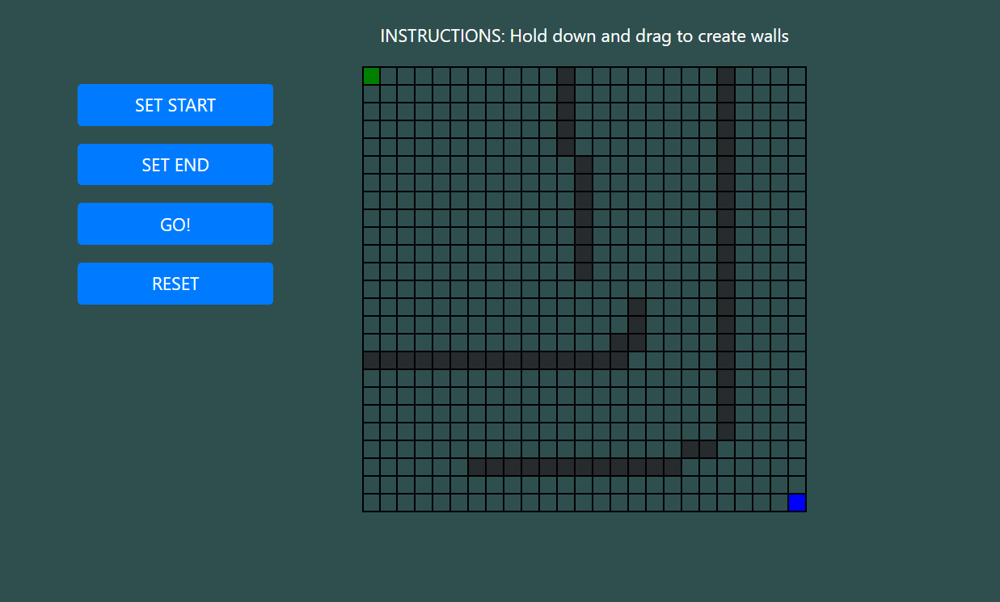

# Algernon-and-his-cheese
Algernon will get to his cheese using the shortest possible route. 

(Due to a lack of time, Algernon remains for now a green-colored square. I hope eventually to turn that green-colored square into an animated mouse that can be picked up and dropped)

### progris ripot 1 -- july 2 2020
Mr Strauss says I shud rite down what I think and evrey thing that I do. They have taken Algernon into the computer and told me to help him get to his cheese. I dunt know how to do that, but Miss Kinnian says I shuldnt worry. 

I like Miss Kinnian becaus shes a very smart teacher. And she said Charlie your going to have a second chance. If you volenteer for this experamenl you mite get smart. I have nuthing more to rite now so I will close for today.

### progress report 2 -- july 3 2020
The operashun dint hurt. He did it while I was sleeping. They took off the bandijis from my eyes and my head today so I can make a PROGRESS REPORT. Dr Nemur who looked at some of my other ones says I spell PROGRESS wrong and he told me how to spell it and REPORT too. I got to try and remember that.

Dr Nemur says I shuld try working on helping Algernon now. 

### progress report 2.1 -- july 3 2020 (evening)
I think I have taught Algernon to find the shortest path. But I have not yet set obstacles; so I cannot be sure. I will try again tomorrow, because now I am tired and Miss Kinnian says I should rest.

### progress report 3 -- july 4 2020
Algernon has made tremendous progress. I can now say with certainty that Algernon will always take the shortest path to the cheese block. I have also programmed definable walls to make it more challenging for him, and also to prove that he is just as capable of making intelligent decisions as his corporeal self.

